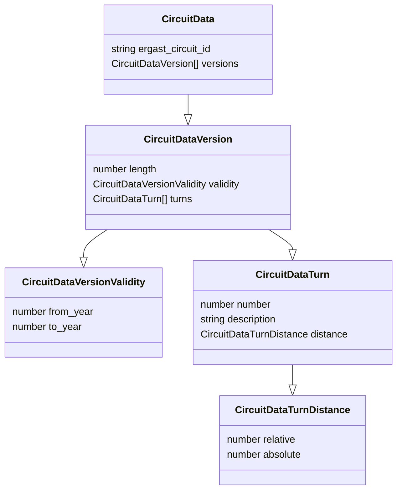

# Welcome to F1 Circuits Data
Thanks so much for passing by and decide to contribute this humble project of mapping as much
data as possible about the F1 circuits.

So far, the only data we are collecting are the turns. Soon we will expand the dataset.

## Getting started

The cicruits are stored inside the folder `circuits`, and each file is representing one single
circuit. The filename is the ID of the circuit used by the [Ergast API](http://ergast.com/), 
e.g.: `bahrain.json`.

### Data model

```typescript
class CircuitData {
  ergast_circuit_id: string;
  versions: CircuitDataVersion[]
}

class CircuitDataVersion {
  length: number;
  validity: CircuitDataVersionValidity;
  turns: CircuitDataTurn[];
}

class CircuitDataVersionValidity {
  from_year: number;
  to_year: number;
}

class CircuitDataTurn {
  number: number;
  description: string;
  distance: CircuitDataTurnDistance;
}

class CircuitDataTurnDistance {
  relative: number;
  absolute: number;
}
```

